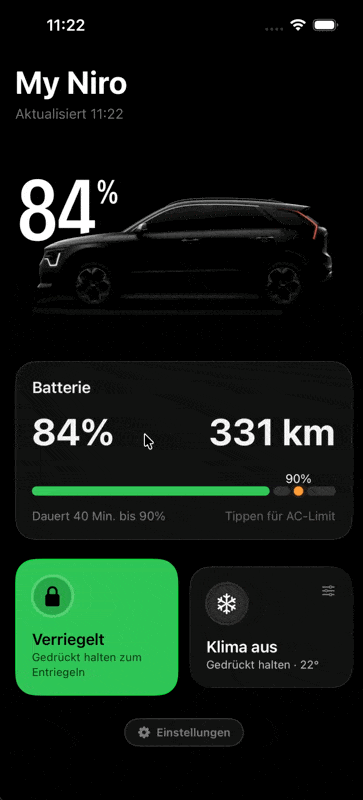
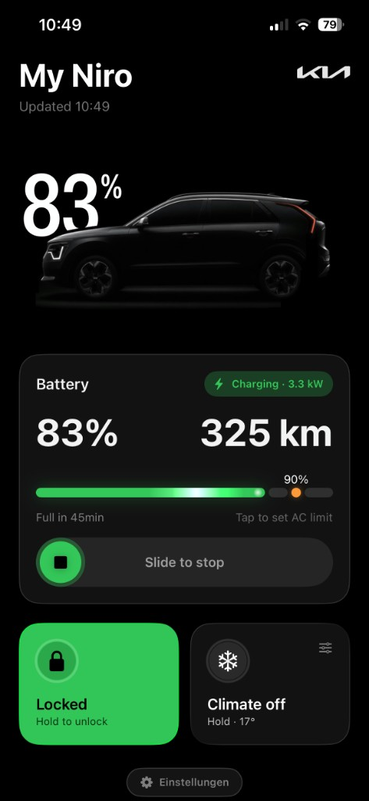
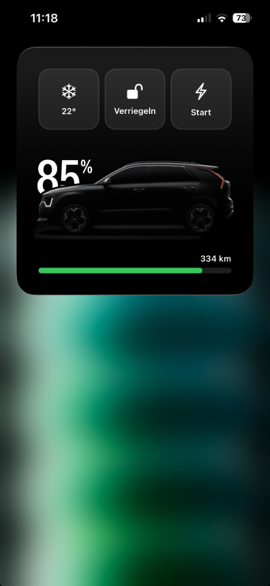

<p align="center">
  
</p>

# MyNiro

Personal Kia Connect (Europe) companion for iOS — charging, climate, unlock, widgets, Apple Watch, and Siri.

> **Disclaimer:** MyNiro is an unofficial, community-built client for Kia Connect.
> It is **not affiliated with, endorsed by, or sponsored by Kia Corporation** or
> any of its subsidiaries. Kia Connect, Kia, and related marks are trademarks of
> their respective owners. Use at your own risk and in accordance with your Kia
> Connect account terms.

## Screenshots

<p align="center">
  
</p>

| Car tab | Home Screen widget |
| :---: | :---: |
|  |  |

## Open in Xcode

```bash
open MyNiro.xcodeproj
```

Sign in with your Kia Connect Europe email, password, and PIN.

## Targets

| Scheme | What |
|---|---|
| **MyNiro** | iOS app + Home Screen widget + Control Center unlock + embedded Watch app/complications |
| **MyNiroWatch** | Watch-only run (simulator / direct Watch install) |

Install on a paired Watch by running **MyNiro** to your iPhone. Then open the MyNiro app once on the Watch, edit the watch face, and pick **MyNiro → Unlock** for a circular slot.

## Regenerating the project

```bash
xcodegen generate   # needs xcodegen on PATH
```

## Stack

- [BetterBlueKit](Packages/BetterBlueKit) (vendored, Kia Europe) — MIT, Copyright Mark Schmidt
- App Group `group.com.holux-design.MyNiro` for widgets / Watch status cache

See [THIRD-PARTY-NOTICES.md](THIRD-PARTY-NOTICES.md) for attribution details.

## Design

Black + green action tiles, Car / Settings tabs. Units are metric (km, °C).

## Siri & Shortcuts

After signing in once on iPhone, say **“Hey Siri, …”** (app name = MyNiro). German phrases work when Siri language is German.

| Action | English | Deutsch |
|---|---|---|
| **Unlock** | Unlock my car with MyNiro · Open my car with MyNiro · Unlock MyNiro | Entsperre mein Auto mit MyNiro · Öffne mein Auto mit MyNiro |
| **Lock** | Lock my car with MyNiro · Toggle lock with MyNiro | Verriegle mein Auto mit MyNiro · Verriegelung umschalten mit MyNiro |
| **Start climate** (saved defaults) | Start climate with MyNiro | Starte die Klimaanlage mit MyNiro |
| **Pre-heat** (22 °C, toggles) | Preheat / warm my car with MyNiro · Pre-heat with MyNiro | Heize das Auto mit MyNiro vor · Vorheizen mit MyNiro |
| **Pre-cool** (17 °C, toggles) | Pre-cool / cool my car with MyNiro · Pre-cool with MyNiro | Kühle das Auto mit MyNiro vor · Vorkühlen mit MyNiro |
| **Toggle / stop climate** | Toggle climate with MyNiro · Stop climate with MyNiro | Klima umschalten mit MyNiro · Stoppe die Klimaanlage mit MyNiro |
| **Charge** (toggles; must be plugged in) | Start charging with MyNiro · Charge with MyNiro | Starte das Laden mit MyNiro · Lade mit MyNiro |

You can also open **Settings → Siri** in the app (or the Shortcuts app) to browse and customize these.

## License

MyNiro app code is licensed under the [MIT License](LICENSE).

BetterBlueKit is vendored under its own [MIT License](Packages/BetterBlueKit/LICENSE).
